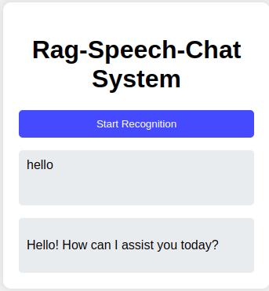
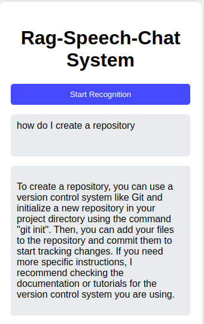

# AskFlow: An End-to-End AI-Powered Knowledge Assistant

**Askflow** is an end-to-end speech-powered application that leverages Retrieval-Augmented Generation (RAG), LangChain, and OpenAI's advanced models to provide instant, accurate answers from your documents. Designed to be intuitive and efficient, **Askflow** enables seamless voice-based interactions, making it easier than ever to access critical information on the go. Whether you're navigating complex data, reviewing essential materials, or simply seeking quick answers, It transforms the way you engage with your documents, ensuring knowledge is always at your fingertips.

The server component is implemented in Python, encapsulated in a Docker container, and the client/frontend is built using JavaScript/HTML. Speech recognition and synthesis are handled by the client. The service is accessible via port 8001, and the development environment is managed using Poetry.

## Table of Contents

- [Features](#features)
- [Architecture](#architecture)
- [Prerequisites](#prerequisites)
- [Getting Started](#Getting-Started)
- [Configuration](#configuration)
- [Usage](#usage)
- [Development](#development)
- [Contributing](#contributing)
- [License](#license)

## Features

- **Speech-to-Text Conversion**: Converts spoken query to text.
- **Ochestration with Langchain**: Utilizes Langchain for LLM ochestratio, RAG and nnatural language understanding (NLU).
- **Retrieval-Augmented Generation**: Tailors responses using RAG with user specific data.
- **Text-to-Speech Conversion**: Converts text responses from the NLU back to speech.
- **Dockerized Deployment**: Easy deployment using Docker.
- **Web-based Interface**: Interactive chat via a browser-based client.

## Architecture

1. **Client/Frontend**: 
    - Built with JavaScript/HTML.
    - Communicates with the server via HTTP requests.
    - Converts user speech to text, makes HTTP request and displays responses.

2. **Server/Backend**:
    - Implemented in Python.
    - Encapsulated in a Docker container.

## Prerequisites

- Docker installed on the host machine.
- Poetry for Python dependency management.

## Getting Started

### Clone the Repository

```bash
git clone https://github.com/kalu-o/rag-speech-chat.git
cd rag-speech-chat
```

### Set Up the Python Environment

Install Poetry if you haven't already:

```bash
curl -sSL https://install.python-poetry.org | python3 -
```

Install the project dependencies:

```bash
poetry install
```

## Configuration

Configuration settings are realized through environment variables. The current setup requires an `openai api key` and `Hugginface api token` for chat and embedding llms respectively. It is possible to modify code to use other open source llm providers. The `PERSIST_DIRECTORY` is the location of the user specific vector store containing document embeddings. The default configuration is as follows:
```
OPENAI_API_KEY=xxxxxxxxxxx
HUGGINGFACEHUB_API_TOKEN=xxxxxxxxxxx
RETURN_SOURCE_DOCUMENTS=True
VECTOR_COUNT=2
CHUNK_SIZE=1500
CHUNK_OVERLAP=150
LLM_TYPE='gpt-3.5-turbo'
EMBEDDING_LLM_TYPE='all-MiniLM-L6-v2'
TEMPERATURE=0.01
```

### Build and Run the Docker Container


```bash
poetry build
poetry export -o requirements.txt
docker compose -f docker-compose.build.yml up -d --build
```

## Usage

### Testing chat endpoint

Open a web browser and navigate to `http://localhost:8001/docs` to access the fastapi interface to test a chat session.

### Connecting the client

After starting the service, got to the `frontend` folder in the root directory and open `index.html` in a supported browser. Speak into your microphone; the system will process your speech and provide responses as shown in the following figures: 





## Development

### Running the Server Locally

To run the server without Docker (useful for development):

```bash
poetry run rag_speech_chat_service
```

### Frontend Development

The frontend files are located in the `static` directory. Open `index.html` in a web browser to test changes.

## Contributing

Contributions are welcome! Please fork the repository and create a pull request with your changes.

## License

This project is licensed under the MIT License - see the [LICENSE](LICENSE) file for details.

